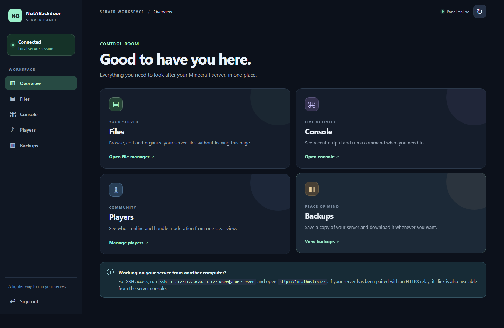

# NotABackdoor

A small web panel that runs inside a Paper server. It is for server owners who need to edit a configuration, look at a log, or moderate a player without navigating a full hosting control panel.

The upcoming `1.0.0-beta.1` release is a complete replacement of the old HTTP panel. It is **not released yet**. Keep using a separate server or a backup when testing it. The supported remote-access setup uses SSH port forwarding. Hosts that offer only plugin upload and a console cannot expose this panel yet.

[See the file editor and mobile overview](docs/TESTING.md#browser-checks-and-screenshots).

## What you can do

- Browse server files; create folders and files; upload, download, edit, rename, move, or delete them.
- Zip a file or folder and extract an archive into a new folder. Extraction rejects paths that escape the chosen destination and limits archive expansion.
- Read recent console output and run a server command.
- See online players and manage operator, ban, and whitelist state by exact player name.
- Save a server backup, download it, or delete it. The plugin saves worlds before archiving and omits Minecraft's live `session.lock` files, but a live server can still change files during the copy. Stop the server for a consistent snapshot.

## Install and sign in

1. Use a Paper and Java combination listed in [the exact live test record](docs/TESTING.md). The beta JAR passed on Paper 1.18.2, 1.21.11, 26.2, and experimental 26.3; other versions are not yet live-tested. Copy the JAR into `plugins/` and start the server.
2. Run `nab setup` **from the server console**. This prints a one-time code that expires in 15 minutes. It is never placed in a URL.
3. On the server itself, open `http://127.0.0.1:8127`. From another computer, run `ssh -L 8127:127.0.0.1:8127 user@your-server` and open `http://localhost:8127` locally.
4. Enter the setup code and choose a password of at least 12 characters. Sign in to the panel.

The panel listens only on `127.0.0.1`. It intentionally refuses a public bind address. No separate web service, database, or proxy is needed; remote access uses the server's existing SSH connection. Change `panel.port` in `plugins/NotABackdoor/config.yml` if 8127 is in use.

If your host does not provide SSH access, you cannot use the documented remote-access setup on that host yet. A custom HTTPS reverse proxy needs its own access controls and must rewrite the upstream `Host` and `Origin` headers to the allowed localhost address; it is not an automatic setup option. Opening a public HTTP port is not a supported shortcut.

If you forget your password, run `nab setup` again in the server console and set a new one. This revokes existing sessions. The password is stored as a salted PBKDF2-HMAC-SHA256 hash in `plugins/NotABackdoor/auth.properties`. Keep that file and your SSH account private.

### Upgrade from the old panel

The first start copies an old `config.yml` to a timestamped `.legacy-*.bak` file and writes a safe v2 configuration. Review that backup privately, then remove it when you no longer need it. Old public HTTP, password-in-URL, and `clearFiles` settings are ignored. The plugin does not delete server files on startup.

## Design and safeguards

The browser UI uses the same-origin API. Every state-changing request requires a session-specific request token, and requests from a foreign browser origin are denied. Sessions expire after two hours and are invalidated when the password changes. Login attempts are throttled. Panel responses use no-store, a restrictive content security policy, and frame protection.

File paths stay under the server process directory, including `plugins/` and `server.properties` even if worlds live elsewhere. Absolute paths, traversal, and symlink targets are rejected. The text editor checks the file hash before saving so a stale tab cannot silently replace newer work. Text edits are limited to 2 MiB, uploads to 128 MiB, ZIP source data and extracted archives to 1 GiB each. A backup excludes its own backup directory and is capped at 20 GiB.

**The panel has full server authority after sign-in.** Treat its password, console access, and SSH tunnel as administrator credentials. A localhost-only design limits accidental internet exposure; it does not make an untrusted person safe to grant panel access.

## Development

Build with `mvn package`; run checks with `mvn test`. The shaded production JAR is `target/NotABackdoor-1.0.0-beta.1.jar`. Java sources target 17; the API baseline is Paper 1.18.2. Browser assets live in `src/main/resources/panel/`, separate from the HTTP, file, authentication, and backup services.

The old implementation and pages were removed because several file endpoints could escape the intended directory and one handler ignored an authentication return value. The replacement has no route to those handlers.
