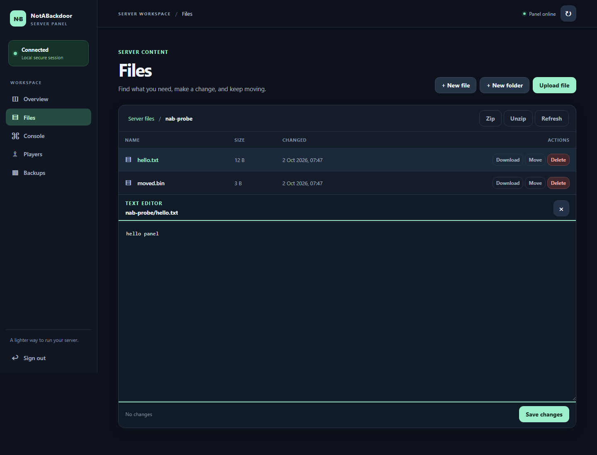
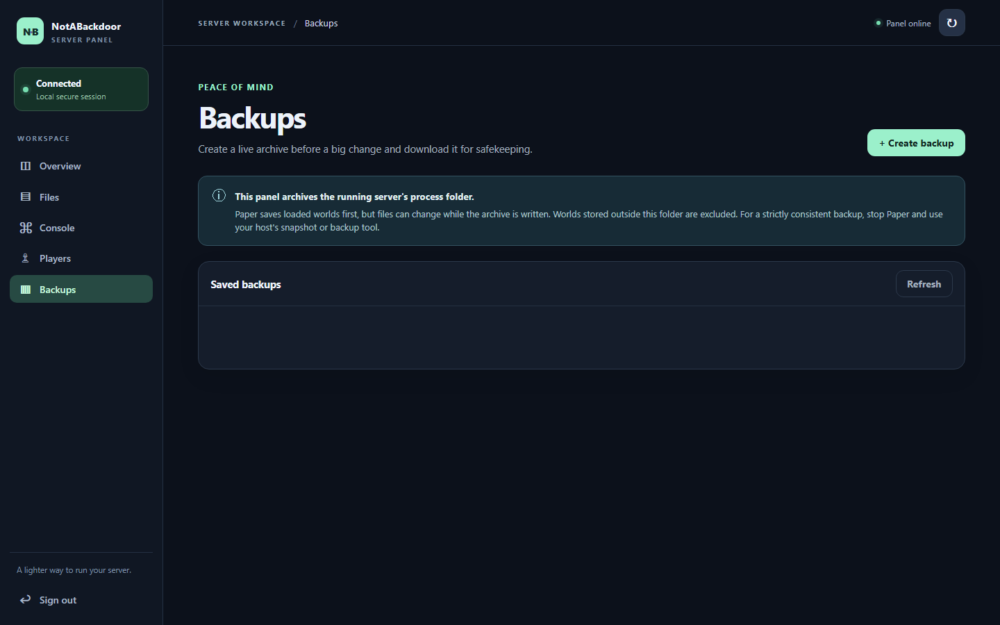
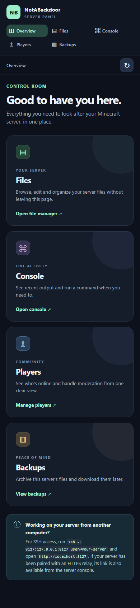
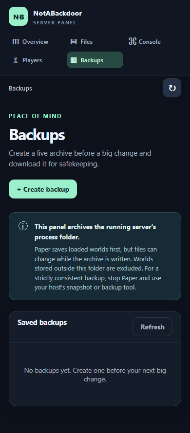

# NotABackdoor exact-JAR test record

## Guided setup 1.0.0-beta.4 candidate

Beta.4 adds an operator setup guide and an opt-in public HTTP listener. The frozen candidate is `testing/notabackdoor/candidates/NotABackdoor-beta.4-502b805f3781.jar` in the parent workspace, built from source revision `7dd68184181f9a11bcc23e40c1eca6b1883f33eb`. Its SHA-512 is:

```text
502b805f3781efb4b72a6eb0c1c6e7a58e9626b922639f9b2e86cc70a75e6b0cb4a05571ccff777a612538237d47920e747ed8f34171b45a9335cf06647d9208
```

The beta.3 hash and results below remain historical; they do **not** qualify this changed beta.4 JAR. The exact beta.4 JAR passed two startup rounds on each pinned Paper build in both direct online and offline modes. Each round ran the full panel probe plus beta.4 access checks; all test worlds were retained and servers stopped. Paper 26.3 remains experimental.

| Minecraft | Paper build | Java | Offline | Online |
| --- | ---: | ---: | --- | --- |
| 1.18.2 | 388 | 17 | Pass | Pass |
| 1.21.11 | 132 | 21 | Pass | Pass |
| 26.2 | 129 | 25 | Pass | Pass |
| 26.3 (experimental) | 140 | 25 | Pass | Pass |

Machine-readable receipts and `testing/notabackdoor/live-beta4/20261002-beta4-502b805f3781/report.md` are stored locally in the parent workspace. On Linux with Java 17, all **33 Maven tests passed with none skipped**. Headless Edge passed first-run password creation, login, plain-HTTP warning, and frozen HTML/CSS/JS asset checks with no page errors. The authenticated LianJordaan OP walkthrough is still pending; automated online-mode startup does not prove a real account joined or used the guide. Beta.4 has not been published yet.

Run automated authentication, menu, configuration, HTTP, browser, and restart checks first. In particular, verify that two permitted operators receive the same unexpired 15-minute first-run code; five invalid setup attempts from one source do not invalidate another source's valid code; only the console can reset an existing password; offline-mode operators cannot issue codes or change access; and loss of OP or `notabackdoor.admin` permission blocks commands and menu clicks. Test shift-click, drag, number-key, double-click, and bottom-inventory interactions while the guide is open.

Check default localhost access, exact public Host/Origin acceptance and rejection, public HTTP warning copy, mode-change session/code revocation, v2-to-v3 migration with `config.yml.v2.bak` created on first beta.4 startup, password preservation, restart persistence, and rollback when a replacement listener cannot bind. Verify that the console rejects `nab access public http://host:port` without the trailing `confirm`, and accepts `nab access public http://host:port confirm` only after explicit entry. The connection check has two parts: local HTTP health and a short-lived browser link that reports a page visit and authenticated sign-in. A passing browser round trip proves only that the browser opening that link reached this panel, not that every external network can reach it. Public HTTP does not encrypt credentials or sessions.

Freeze one beta.4 JAR and rerun its panel and server checks on Paper 1.18.2 build 388 (Java 17), 1.21.11 build 132 (Java 21), 26.2 build 129 (Java 25), and experimental 26.3 build 140 (Java 25). Use isolated worlds and stop the servers afterward. Separately, have **LianJordaan** join a direct `online-mode=true` test server with Microsoft authentication, receive the private reminder, open `/nab`, complete the code/browser walkthrough, and confirm the connection result. A scripted online-mode panel API check alone cannot prove authenticated player login or OP interaction. Only version/build/mode combinations that pass against the unchanged final hash may be listed in the beta.4 release.

## Backup copy 1.0.0-beta.3 candidate

The frozen JAR is `testing/notabackdoor/candidates/NotABackdoor-beta.3-028a29cf5470.jar` in the parent workspace, built from source commit `68f51732215a2d5725c0766f552fab84f7bc30ca`. Its SHA-512 is:

```text
028a29cf547071906f171766122efd02ed2e027d589d6686f30e349bd125802c44e7b393ae8deec448938cf8c2573434cab825981c7ee44d8df3f6f4b1dd846b
```

Beta.3 corrects the backup guidance and bumps the plugin version. The panel archives the **running server process folder** after asking Paper to save loaded worlds; it does not include world folders stored elsewhere, and files can change during copying. The plugin cannot make its in-panel archive after Paper stops. For a strictly consistent full-server backup, stop Paper and use the host's snapshot or backup tool. The archive implementation did not change in this candidate.

A clean Windows JDK 21 build reproduced all **324 JAR entry bytes** in the frozen candidate; only ZIP container metadata changed the whole-file hash. A clean Linux JDK 17 build passed all **18 Maven tests with none skipped**. The relay Python suite passed **14/14 tests with none skipped**, including the real Java HTTPS integration. Browser JavaScript syntax passed. Attestation and unit receipts are `testing/notabackdoor/candidates/attestation-beta3-windows.json` and `linux-unit-beta3.json` in the parent workspace.

The same exact JAR passed 40 panel checks on first startup and 41 after restart on each pinned Paper combination. Each test server stopped afterward and retained its world. Paper 26.3 is experimental.

| Minecraft | Paper build | Java | Mode | Result |
| --- | ---: | ---: | --- | --- |
| 1.18.2 | 388 | 17 | Offline | 40 + 41 checks passed |
| 1.21.11 | 132 | 21 | Offline | 40 + 41 checks passed |
| 26.2 | 129 | 25 | Offline | 40 + 41 checks passed |
| 26.3 (experimental) | 140 | 25 | Offline | 40 + 41 checks passed |
| 26.2 | 129 | 25 | Online | 40 + 41 checks passed |

The active plugin also passed **11/11** local certificate-verified HTTPS relay bridge checks on Paper 1.18.2 and 26.2, including pairing, Secure route/session cookies, panel login, asset streaming, foreign-Origin denial, and revocation. A separate Paper 1.21.11 build 132 server with a scripted offline-mode Minecraft client passed **30/30** operator, console, whitelist, ban, pardon, reconnect, and denial checks. Its receipt is `testing/notabackdoor/live-beta3-client/20261002T055136Z/result.json`; the remote server stopped with its world retained. The Paper 26.2 online-mode check did not authenticate a Microsoft player.

Headless Edge navigated the exact beta.3 JAR on Paper 1.18.2, checked the Backups notice and review dialog text, and captured **nine unedited desktop/mobile screenshots with no page errors**. The Backups mobile notice fits without horizontal scrolling. The receipt is `testing/notabackdoor/live-beta3/screenshots/browser-probe.json`; selected captures are embedded below and the seven-image Modrinth gallery plan is retained locally. None was uploaded.

The relay remains private: no dedicated public hostname, DNS, matching certificate, or deployed external browser/plugin probe exists. `za.bytebuilders.co.za` serves another application and cannot be reused even on another port because browser cookies are shared by hostname. A release that claims the public relay still requires a fresh external pairing/login/revocation probe, owner approval, and a live TLS recheck. A release limited to the tested localhost HTTP panel does not claim or test public relay availability. SSH forwarding remains the available remote route. Only the four Paper versions above were live tested; Purpur, Spigot, Bukkit, other Paper builds, default Windows JDK filesystem providers, and authenticated Microsoft logins are not claimed.

## Outbound relay 1.0.0-beta.2 candidate

The frozen candidate is `testing/notabackdoor/candidates/NotABackdoor-beta.2-091ad803c867.jar` in the parent workspace, built from source commit `633af9d0af1268388b5680531e38c5ff2c4c3699`. Its SHA-512 is:

```text
091ad803c86783c63d6293db186c45b396e76a6f53a6051a6a3e6195c8ea293f578ce9369315a91d633693b3501ee414133aec4f8f48ef4b5340e099442262a0
```

The JAR targets Java 17. A clean Windows checkout compiled with JDK 21 reproduced all **324 JAR entry bytes** from the candidate. The whole archive hash differs because ZIP container metadata differs; the attestation is `testing/notabackdoor/candidates/attestation-relay-beta2-windows.json`. A separate clean checkout on a Linux filesystem, built with JDK 17, passed all **18 Maven tests with none skipped**, including symlink-race checks. Its line endings and compiler differ from the Windows candidate, so that build is test evidence, not the bytewise provenance proof. The local Python relay suite passed **14 tests**, including TLS rejection, pairing, durable limits, bounded streaming, concurrent jobs, cancellation, restart, and revocation. Browser JavaScript syntax passed.

The **same exact JAR** passed two startup rounds on each pinned Paper combination: 40 panel checks at first start and 41 after restart, including password persistence. Every server stopped afterward and its world was retained. Paper 26.3 remains experimental.

| Minecraft | Paper build | Java | Mode | Result |
| --- | ---: | ---: | --- | --- |
| 1.18.2 | 388 | 17 | Offline | 40 + 41 checks passed |
| 1.21.11 | 132 | 21 | Offline | 40 + 41 checks passed |
| 26.2 | 129 | 25 | Offline | 40 + 41 checks passed |
| 26.3 (experimental) | 140 | 25 | Offline | 40 + 41 checks passed |
| 26.2 | 129 | 25 | Online | 40 + 41 checks passed |

Local HTTPS relay bridge checks also passed **11/11** on Paper 1.18.2 and 26.2, with the actual plugin forwarding the panel through a certificate-verified local relay. The checks included console pairing link and separate code, route and panel cookies, real page assets, panel login, foreign-Origin denial, untrusted-certificate rejection, and revocation. This does not prove a public DNS, Nginx, or certificate deployment. Those remain unconfigured.

An isolated Paper 1.21.11 build 132 server, Java 21, with an offline-mode scripted Minecraft client separately passed **30/30** operator, console, whitelist, ban, pardon, reconnect, and denial checks against this JAR. The retained receipt is `testing/notabackdoor/live-relay-client/20261002T043912Z/result.json`; the server was stopped afterward. No Microsoft-authenticated player joined an online-mode server. The 26.2 online-mode check proves startup and panel API behavior only.

Headless Edge captured eight unedited desktop/mobile screenshots while the exact JAR ran on Paper 1.18.2. It opened and inspected a file, navigated all views, and reported no page errors. The browser receipt records this JAR and the embedded panel-asset SHA-256 values. Its captures remain under `testing/notabackdoor/live-relay-beta2/screenshots/` in the parent workspace; the screenshots embedded below now show the corrected beta.3 copy.

The relay binds to loopback by default and has review-only dedicated-hostname service and Nginx templates. No public relay exists yet. The current `za.bytebuilders.co.za` host serves a different application; it cannot be reused even on a separate port because cookies are shared by hostname. A dedicated origin, DNS, matching TLS certificates, owner approval, and live public pairing/login/revocation checks are prerequisites for a future release that claims the public relay; they do not block a localhost HTTP release. SSH forwarding remains available now. The relay operator can see panel passwords, files, commands, and backups in transit; SSH is the higher-privacy choice. One browser profile supports one active route/session on a relay origin, so switching servers needs re-pairing or separate browser profiles.

Only the four Paper versions above were live tested. Purpur, Spigot, Bukkit, other Paper builds, default Windows JDK filesystem providers, and authenticated Microsoft logins remain unverified or unsupported as stated.

## Secure-file 1.0.0-beta.1 candidate

The earlier frozen candidate in the parent workspace is `testing/notabackdoor/candidates/NotABackdoor-beta.1-7827286ffc8c.jar`, built from production-source commit `df5be879e076940ddbb35e682af31c2a4d1a65b1`. Its SHA-512 is:

```text
7827286ffc8c792a480e9b005d339cb4d9574b7c0968cf19b1c8814605bb7dd2391787b883a3caab5fdebbb008849fdd4a33fea4c16cb2ce25dc113da259ae7b
```

The file manager, downloads, ZIP operations, and backups now work relative to open `SecureDirectoryStream` handles to prevent a concurrent symlink swap from redirecting them outside the server root. The plugin refuses to start if the Java filesystem provider has no secure directory handles. The default Windows JDK provider is unsupported; the five live probes below used Ubuntu 24.04 WSL2 on a local Linux filesystem. The remote real-client probe ran on Linux. The prior beta candidate and its results remain below as history, but its JAR has a known symlink-swap escape and must not be published.

The Linux Java 17 Maven build passed **18 tests, none skipped**, including symlink-swap stress checks for read, download, upload/edit, ZIP, and backups. `node --check` passed for the browser script. A clean checkout of the source commit was rebuilt with Java 17; all **318 JAR ZIP entries** matched the frozen candidate byte-for-byte. The archive's whole-file hash differs because ZIP container metadata differs. The attestation is `testing/notabackdoor/candidates/attestation-secure-beta1.json` in the parent workspace.

Each pinned Paper binary and Java runtime was recorded. The **same frozen JAR** passed 40 panel checks at first startup and 41 after a stop/restart, including password persistence. Every test server was stopped with its world retained. Paper 26.3 is experimental.

| Minecraft | Paper build | Java | Offline-mode result |
| --- | ---: | ---: | --- |
| 1.18.2 | 388 | 17 | 40 + 41 checks passed |
| 1.21.11 | 132 | 21 | 40 + 41 checks passed |
| 26.2 | 129 | 25 | 40 + 41 checks passed |
| 26.3 (experimental) | 140 | 25 | 40 + 41 checks passed |

Paper 26.2 build 129 also passed 40 + 41 checks with `online-mode=true`. The machine-readable receipts, Paper SHA-256 hashes, redacted diagnostics, and stopped WSL worlds are under `testing/notabackdoor/live-secure-beta1/` in the parent workspace. The browser assets are byte-identical to the earlier screenshot build, so the eight unedited desktop/mobile screenshots below still represent this candidate's UI; those browser interactions were run on the earlier JAR and are not counted as current-JAR live checks.

The secure-file candidate separately passed a **30/30** real-client probe on Paper 1.21.11 build 132, Java 21, with `online-mode=false`. The scripted client joined while panel actions changed operator, console, whitelist, ban, and pardon state; the probe checked each game outcome and stopped the retained server afterward. One explicit Paper connection-throttle response was retried before the actual ban-denial check passed. A prior failed probe stopped at a throttle response after 27 checks and remains in history. The passing receipt is `testing/notabackdoor/live-client/20261002T014446Z/result.json` in the parent workspace. No Microsoft-authenticated login was tested.

## Historical 1.0.0-beta.1 candidate

The frozen beta is `testing/notabackdoor/candidates/NotABackdoor-beta.1-957e24e59991.jar` in the parent workspace, built from production-code commit `d4ef773fb95a1e7b6032793993acc7efe6a6f2e9`. Its SHA-512 is:

```text
957e24e59991fc6b2bdf69cf4d31ebe3834e9c64d0df37ab952869101735b9637c1ccf89c5b0e104ca251e54ed331b4e09d81ae08bc6123adca786a1349ab72e
```

`mvn clean package` passed all 12 unit tests; `node --check` passed for the browser script. The exact installed beta JAR passed the isolated HTTP/API probe after a restart on each pinned Paper build below. Each test world was retained and its server was stopped afterward. The 26.3 Paper build is experimental.

| Minecraft | Paper build | Java | Offline-mode result |
| --- | ---: | ---: | --- |
| 1.18.2 | 388 | 17 | 41/41 checks passed |
| 1.21.11 | 132 | 21 | 41/41 checks passed |
| 26.2 | 129 | 25 | 41/41 checks passed |
| 26.3 (experimental) | 140 | 25 | 41/41 checks passed |

Paper 26.2 build 129 also passed 41/41 checks with `online-mode=true`. The checks cover setup, password persistence, session and request-token enforcement, Host/Origin/traversal denial, file actions, ZIP/unzip, logs, player-list API, command dispatch, backup create/download/delete, and logout. These four-version automated panel checks did not join a Minecraft player. The online-mode result proves the panel runs while server authentication is enabled, but does not prove real account login.

Machine-readable receipts and server logs are under `testing/notabackdoor/live-beta1/paper-<version>-b<build>-<mode>/` in the parent workspace. On Paper 1.18.2, headless Edge also passed desktop/mobile navigation, text-editor interaction, and eight unedited screenshots with no page errors. Four separate browser checks for unsaved edits, delayed navigation, and expired-session download recovery passed. Their receipts and captures are in `testing/notabackdoor/live-beta1/screenshots/`; selected captures are embedded in this repository's README and testing page.

### Real-client panel probe

The **same frozen beta JAR** passed a separate **30/30** probe on Paper **1.21.11 build 132**, Java **21**, with `online-mode=false`. A scripted Minecraft protocol client joined the running server while an authenticated panel session sent operator, console, whitelist, ban, and pardon actions. The probe observed the player list and operator state, the console message arriving in the client, successful whitelisted rejoin, rejection after whitelist removal, an immediate ban kick and rejected rejoin, then successful rejoin after pardon. It also checked that anonymous or logged-out panel requests, a missing request token, and malformed console commands were rejected. The server stopped after the probe; its world was retained.

The machine-readable receipt and readable report are `testing/notabackdoor/live-client/20261002T004250Z/result.json` and `report.md` in the parent workspace. The receipt records the installed plugin SHA-512 above, Paper JAR SHA-256, test timestamps, individual outcomes, and server logs. This probe verifies real game connections in **offline mode**; it does not establish Microsoft-authenticated player login in online mode. The separate 26.2 online-mode panel API probe did not join a player.

The beta has not been tested on other Minecraft versions, Purpur, Spigot, or Bukkit. The panel binds to localhost; the documented remote route requires SSH access. A host offering only plugin upload and console access cannot use this remote route.

## Historical 1.0.0-dev candidate

The following earlier receipts apply only to the development JAR named below. Its hash differs from the beta and its passes must not be counted as beta passes.

The frozen candidate is `NotABackdoor-90d246db0a3d.jar`, SHA-512:

```text
90d246db0a3d6345f64cd90d4037cf584653bd898ec47a153396d6326a6d11c7a84858d5a277f819a18cfb1e0192b1a3c264fe410269cf80d3566acaf2f1d1e0
```

This exact JAR passed the same isolated-server HTTP/API probe on these pinned Paper builds. Each server was stopped after its probe and its world was retained. `26.3` is an experimental Paper build.

| Minecraft | Paper build | Java | Result |
| --- | ---: | ---: | --- |
| 1.18.2 | 388 | 17 | 41/41 checks passed |
| 1.21.11 | 132 | 21 | 41/41 checks passed |
| 26.2 | 129 | 25 | 41/41 checks passed |
| 26.3 (experimental) | 140 | 25 | 41/41 checks passed |

The probes checked startup, one-time console setup, password storage and restart persistence, session and request-token enforcement, Host/Origin/traversal rejection, file creation/edit/conflict/upload/download/move/delete, ZIP and unzip, logs, player listing, console dispatch, backups, and logout. They also confirmed the SHA-512 of the installed JAR. The four machine-readable offline-mode receipts are kept under `testing/notabackdoor/live/paper-<version>-b<build>/http-probe-result.json` in the parent workspace.

Paper 26.2 build 129 also passed the same 41/41 checks with `online-mode=true` using that exact JAR. Its distinct receipt is `testing/notabackdoor/live/paper-26.2-b129/http-probe-online-result.json`; the instance was returned to offline mode and stopped afterward. This establishes that the panel functions while a server has online authentication enabled, but does not prove real account login.

The pinned Paper JAR SHA-256 values were `0578f18f4d632b494b468ec56b3b414b5b56fea087ee7d39cf6dcdf4c9d01f05` (1.18.2), `5ffef465eeeb5f2a3c23a24419d97c51afd7dbb4923ff42df9a3f58bba1ccfba` (1.21.11), `b1d8f6bfa1b6101fa8e947b53041cb3bdf5540e7b83b6547ca19ba7edefeb083` (26.2), and `98aabc113a80b9b5e183475e839a17cf99c39c915a1f46b8f35a5e89fd5de0f1` (26.3).

## Browser checks and screenshots

Headless Edge opened the exact beta.3 panel on Paper 1.18.2, signed in, navigated all views, opened and inspected a file, and rendered desktop and mobile layouts without page errors. It checked the Backups notice and confirmation, then captured nine screenshots in `testing/notabackdoor/live-beta3/screenshots/` in the parent workspace. The earlier beta.2 and beta.1 browser receipts remain in their own histories.









The images above are unedited captures of the exact beta.3 candidate. The browser checks did not join the Minecraft server as a player. All local test servers were loopback-bound. None of these checks establish Microsoft-authenticated player login or compatibility on untested Paper builds, Spigot, Purpur, or other loaders.
